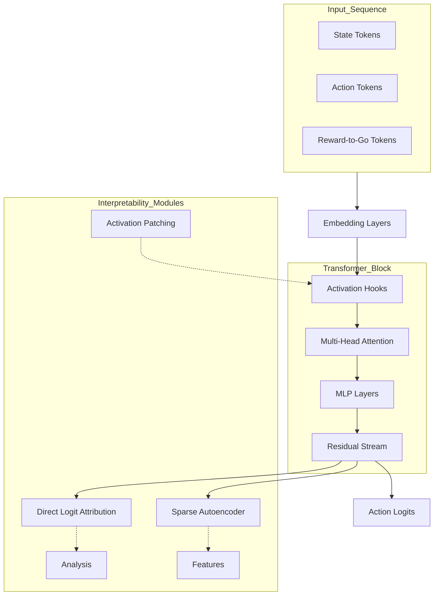

# DT-Circuits: Mechanistic Interpretability for Decision Transformers

[](https://www.python.org/downloads/)
[](https://pytorch.org/)
[](https://opensource.org/licenses/Apache-2.0)
[](https://github.com/TransformerLensOrg/TransformerLens)

DT-Circuits is a research framework for mechanistic interpretability of Decision Transformers, focused on causal analysis, sparse feature decomposition, and circuit-level understanding of sequential decision-making agents.

---

## Table of Contents
- [Core Objectives](#core-objectives)
- [Technical Overview](#technical-overview)
- [Capabilities](#capabilities)
- [Project Structure](#project-structure)
- [Installation and Usage](#installation-and-usage)
- [Documentation](#documentation)
- [Citation](#citation)
- [License](#license)

---

## Core Objectives

1.  **Map Information Flow**: Quantify how input tokens (State, Action, Reward-to-Go) contribute to the output action logits.
2.  **Causal Verification**: Use intervention techniques to identify the minimal set of model components required for specific behaviors.
3.  **Feature Decomposition**: Use Sparse Autoencoders (SAEs) to identify monosemantic features within the model's residual stream.
4.  **Behavioral Control**: Modify agent decisions at inference time by manipulating internal activations.

---

## Technical Overview

The framework centers around `HookedDT`, a Decision Transformer implementation that allows for activation hooking and cache management.

### Information Flow Diagram



---

## Capabilities

### Causal Mediation and Attribution
*   **Direct Logit Attribution (DLA)**: Measures the direct contribution of individual attention heads and MLP layers to the final logit output.
*   **Activation Patching**: Substitutes internal activations from different runs to isolate the causal effect of specific inputs on model behavior.
*   **Path Patching**: Traces how information flows through specific connections between model components.

### Feature Discovery and Analysis
*   **Sparse Autoencoders (SAEs)**: Decomposes the residual stream into a set of sparse features, helping to resolve polysemanticity.
*   **Induction Scanning**: Identifies attention heads that perform pattern-matching and temporal sequence recognition.
*   **Automated Circuit Discovery (ACDC)**: Prunes the model to identify the smallest functional subgraph sufficient to perform a specific task.

### Behavioral Steering
*   **Activation Steering**: Injects specific vectors into the residual stream to bias the agent's decision-making without retraining the weights.
*   **Safety Auditing**: Monitors SAE reconstruction error and feature activation to detect anomalous or out-of-distribution internal states.

---

## Project Structure

```text
DT-Circuits/
├── src/
│   ├── dashboard/          
│   │   └── app.py          # Streamlit-based visualization UI
│   ├── data/               
│   │   └── harvester.py    # PPO-based expert trajectory harvester
│   ├── interpretability/   
│   │   ├── acdc.py         # Automated Circuit Discovery logic
│   │   ├── attribution.py  # Direct Logit Attribution (DLA)
│   │   ├── evolution.py    # Training Dynamics Analysis
│   │   ├── induction_scan.py # Induction head detection logic
│   │   ├── nla.py          # Natural Language Autoencoder Explainer
│   │   ├── patching.py     # Causal activation patching tools
│   │   ├── path_patching.py # Path-based causal intervention engine
│   │   ├── sae_manager.py  # SAE deployment and anomaly detection
│   │   ├── steering.py     # Steering vector generation and injection
│   │   └── universality.py # Cross-architecture feature mapping
│   ├── models/             
│   │   └── hooked_dt.py    # TransformerLens-wrapped Decision Transformer
│   ├── config.py           # Centralized hyperparameter management
│   └── utils/              
├── tests/                  # Unit tests for all modules
├── config.yaml             # External hyperparameter storage
├── requirements.txt 
└── docs/                        
```

---

## Configuration

Hyperparameters are managed through a dual-system for both ease of use and research reproducibility:

1.  **`config.yaml`**: The primary interface for users. You can modify model dimensions, training epochs, and environment settings here without touching the code.
2.  **`src/config.py`**: Defines the underlying structure using Python dataclasses. It automatically loads overrides from `config.yaml` at runtime.

### Key Configuration Sections

| Section | Description | Key Parameters |
| :--- | :--- | :--- |
| **`model`** | Architecture settings for the Decision Transformer | `n_layers`, `d_model`, `n_heads`, `max_length` |
| **`data`** | Settings for expert trajectory collection | `env_id`, `num_episodes` (for DT training) |
| **`train`** | DT training hyperparameters | `lr`, `epochs`, `seed` |
| **`sae`** | Sparse Autoencoder training hyperparameters | `expansion_factor`, `k`, `num_episodes` (SAE specific) |

**Example: Independent Data Control** 
You can control the amount of data used for general training vs. interpretability separately:
```yaml
data:
  num_episodes: 1000  # Episodes for training the DT teacher

sae:
  num_episodes: 500   # Episodes for extracting SAE activations
```

---

## Installation and Usage

### Setup
```bash
python -m venv venv
source venv/bin/activate  
pip install -r requirements.txt
```

### Dashboard Execution
Launch the `DT-Explorer` dashboard. The dashboard will initialize with a random model if no trained weights are detected.
```bash
streamlit run src/dashboard/app.py
```

### Workflow

1. **Data Harvesting & Model Training**
   ```bash
   python scripts/train_dt.py
   ```

2. **SAE Training**
   ```bash
   python scripts/train_sae.py
   ```

3. **Interpretability Analysis**
   ```bash
   streamlit run src/dashboard/app.py
   ```

### Alternative: Makefile
Common tasks can also be executed via `make`:
```bash
make setup      # Install dependencies
make train      # Run full training pipeline (DT + SAE)
make dashboard  # Launch DT-Explorer
```

---

## Documentation

Detailed technical documentation for specific modules:
*   [Circuit Discovery](./docs/circuit_discovery.md)
*   [Causal Intervention](./docs/activation_patching.md)
*   [SAEs and Steering](./docs/sae_steering.md)

---

## Citation

```bibtex
@software{dt_circuits2026,
  author = {Sadhumitha S.},
  title = {DT-Circuits: Mechanistic Interpretability for Decision Transformers},
  year = {2026},
  url = {https://github.com/sadhumitha-s/DT-Circuits}
}
```

---

## License
Apache 2.0
