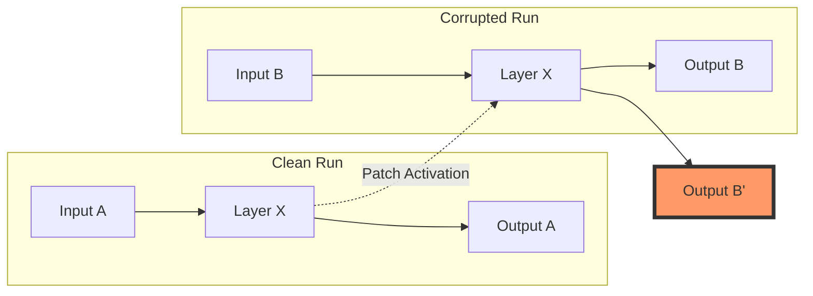
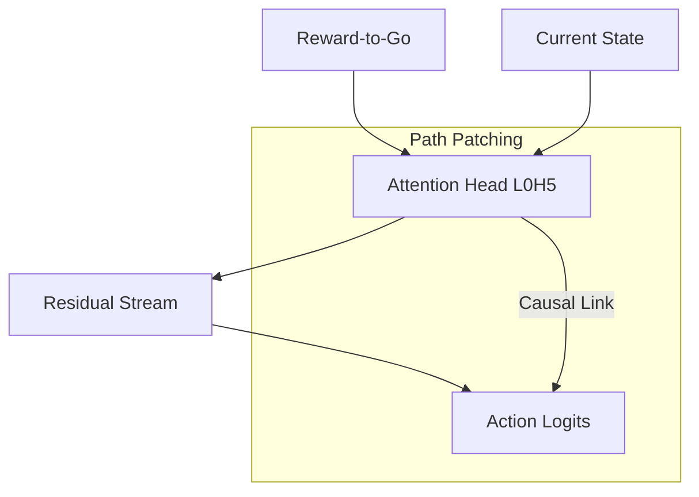

# Causal Interventions: Activation Patching

Activation patching (or Resample Ablation) is a technique used to localize where information is processed in a model by swapping activations between a "clean" run and a "corrupted" run.

## Patching Workflow

1. **Clean Run**: Run the model on a standard input (e.g., a high-reward trajectory).
2. **Corrupted Run**: Run the model on a modified input (e.g., a zero-reward trajectory).
3. **Patch**: Replace a specific activation (head, residual stream, etc.) in the corrupted run with the corresponding activation from the clean run.
4. **Measure**: Observe the change in output (logits). If the output recovers toward the clean run, the patched component is causally significant.

## Path Patching

Path patching is a more granular version of activation patching. Instead of patching a whole layer, it patches the information flow between two specific nodes (e.g., from an Attention Head to the Final Logits).

### Example: Goal Token → Action Logit

