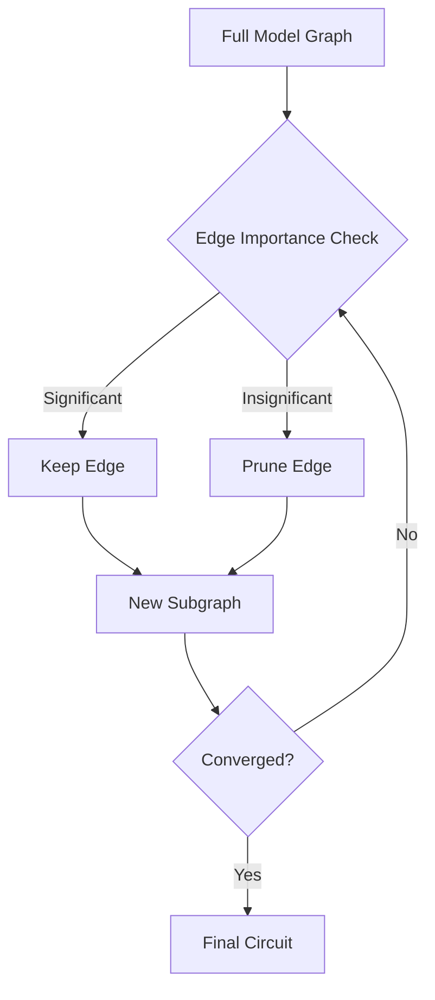
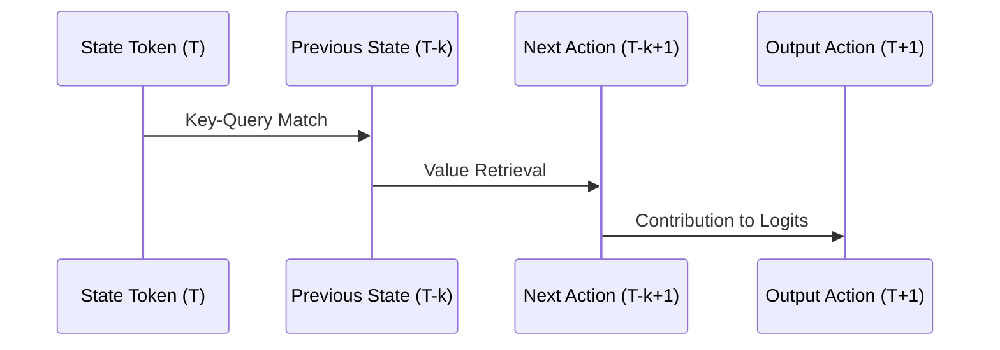

# Circuit Discovery in Decision Transformers

Circuit discovery is the process of identifying the minimal set of neural components (heads, neurons, paths) that are responsible for a specific behavior in a Decision Transformer.

## Automated Circuit Discovery (ACDC)

ACDC is used to prune the full model into a task-specific subgraph. It works by iteratively removing edges that do not significantly contribute to the model's performance on a specific metric (e.g., action prediction).

### ACDC Workflow

## Induction Head Discovery

Induction heads are key components in Transformers that perform temporal pattern recognition. In DTs, these are often responsible for matching current states to past experiences to determine the next action.

### The Induction Mechanism
Induction heads typically follow a two-step pattern:
1. **Search**: Look for previous occurrences of the current token.
2. **Retrieve**: Extract the token that followed the previous occurrence.

