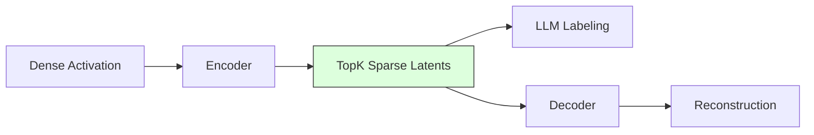
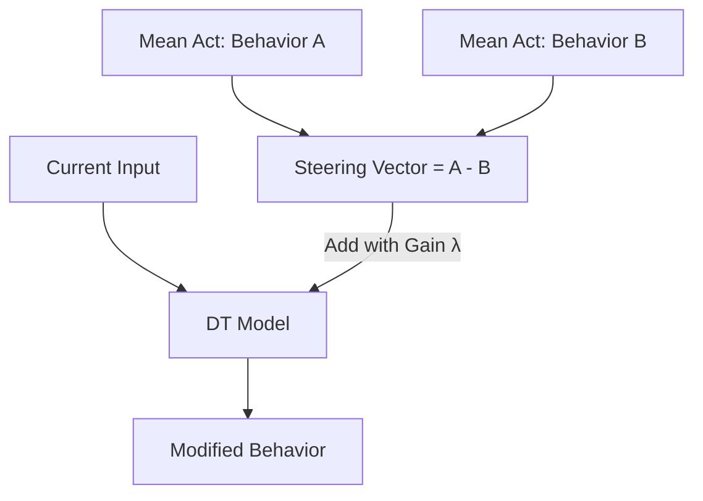

# SAEs and Activation Steering

Sparse Autoencoders (SAEs) allow us to decompose the residual stream into human-interpretable features, while steering allows us to manipulate those features to change agent behavior.

## Sparse Autoencoders (SAE)

An SAE decomposes activations into a set of "monosemantic" features. By projecting dense vectors into a higher-dimensional space, we find latents that correspond to specific concepts (e.g., "Wall ahead").

### TopK SAEs
Instead of using an L1 penalty to force sparsity, we use **TopK SAEs**. These restrict the model to exactly $k$ active features per input. This makes the internal logic cleaner and easier to analyze compared to standard ReLU SAEs.

### Natural Language Labeling (NLA)
To avoid manual inspection of thousands of features, we use an **NLA Explainer**. This tool takes the top activations for a feature and uses a Language Model to generate a human-readable label (e.g., "Feature #402: Activates when a red key is visible").

## Activation Steering

Steering involves adding a "direction" vector to the model's activations to shift its behavior. This is often done using **Contrastive Activation Addition**.

### Steering Pipeline

1. **Collect States**: Gather activations for two contrasting behaviors (e.g., "Moving Fast" vs "Moving Slow").
2. **Compute Vector**: Calculate the difference between the mean activations of these two sets.
3. **Inject**: Add this vector (multiplied by a coefficient) to the model during inference.

## Cross-Architecture Universality Probes

We use **Universality Probes** to check if features are model-specific or "universal" to the task. By comparing the SAE features of a Decision Transformer with the activations of a different model (like a DQN) trained on the same environment, we can identify shared representational spaces.

- **High Correlation**: Suggests the feature is a fundamental concept required to solve the task (e.g., "The concept of a wall").
- **Low Correlation**: Suggests the feature might be an artifact of the specific architecture or training algorithm.
