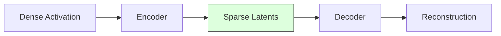
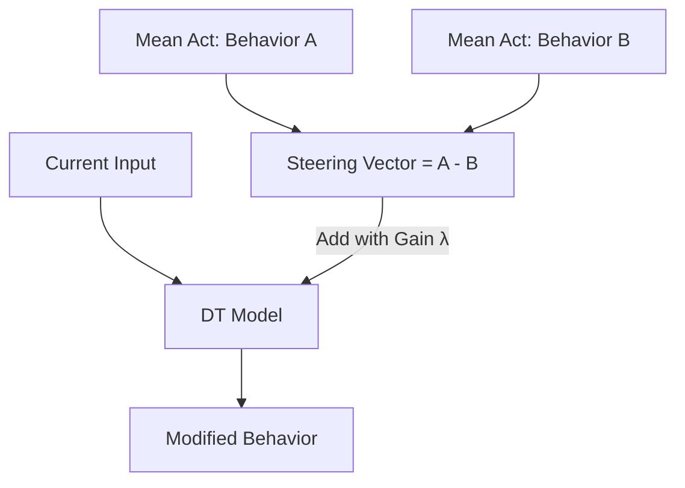

# SAEs and Activation Steering

Sparse Autoencoders (SAEs) allow us to decompose the residual stream into human-interpretable features, while steering allows us to manipulate those features to change agent behavior.

## Sparse Autoencoders (SAE)

An SAE learns a sparse representation of activations. By projecting dense vectors into a higher-dimensional space with a sparsity constraint (L1 penalty), we find "monosemantic" latents that often correspond to specific concepts (e.g., "Wall ahead", "Turning left").

## Activation Steering

Steering involves adding a "direction" vector to the model's activations to shift its behavior. This is often done using **Contrastive Activation Addition**.

### Steering Pipeline

1. **Collect States**: Gather activations for two contrasting behaviors (e.g., "Moving Fast" vs "Moving Slow").
2. **Compute Vector**: Calculate the difference between the mean activations of these two sets.
3. **Inject**: Add this vector (multiplied by a coefficient) to the model during inference.

